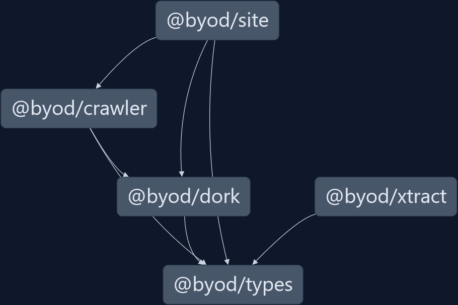

# BuildYourOwnData Monorepo

This is the monorepo that contains all the code for BuildYourOwnData. BYOD is an *experimental* idea which combines a natural search, with an extensive crawler along with a CSV parser to be able to fetch and prepare any kind of dataset from the internet. Hence, the project houses the following packages.

| Project                    | Description                                                                                                       | Browser |
|----------------------------|-------------------------------------------------------------------------------------------------------------------|---------|
| [@byod/crawler](./crawler) | implementation for the main crawler. Includes caching                                                             | no      |
| [@byod/dork](./dork)       | a natural-language parser which converts unstructured text input into a [`SearchIntent`](./types/index.ts) object | yes     |
| [@byod/site](./site)       | the SSR site implemented using NextJS and MUI                                                                     | yes     |
| [@byod/types](./types)     | types for the entire codebase                                                                                     | no      |
| [@byod/xtract](./xtract)   | an interface to download and modify CSV based on the [`SearchIntent`](./types/index.ts) object                    | yes\*   |

